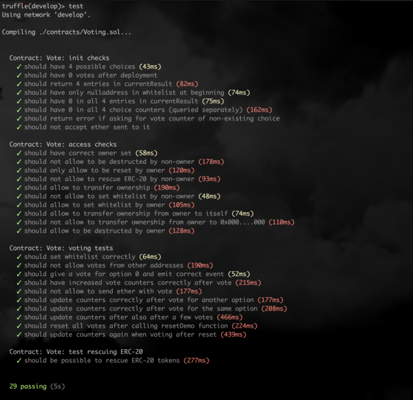

# Smart Contract for simple Voting Example

This subdirectory contains an Ethereum Smart Contract example,
which implements a very simple and basic voting contract.

This contract has been deployed to the public ethereum blockchain
at address: `TODO`


### Requirements

This was developed using Node v10.12.0 and Truffle v5.0.0-next.11.

(Since v5 truffle supports async/await syntax which makes life easier
in writing tests and also uses web3 1.0. Be aware thet web3 1.0 uses
the bn.js library instead of BigNumber.js)


```

# check for recent node version (8.x or 10.x)
node -v

# Install Truffle v5.0.0 or higher (currently in beta)
npm install -g truffle@beta
# or
npm install -g truffle

# check version
truffle --version

# save dependencies in package.json
npm install --save chai bn-chai chai-as-promised


```


### Test

```
# start truffle develop console (will start its own local JavaScript Ethereum implementation)
truffle develop

# start tests
test
```

Screenshot:<br><br>



### Interactive tests (during development)

```
# start truffle develop console (will start its own local JavaScript Ethereum implementation)
truffle develop

# Interact with contract interactively
...
```


### Ropsten Testnet

```
# Deploy to ropsten:

# Create file ".mnemonicSecret" with mnemonic seed. Make sure there are Ropsten ETH
# on the first address generated by this seed.

# Start truffle console on Ropsten

# Start 'migrate' to deploy..
truffle(ropsten)> migrate

# or redeploy with --reset:
truffle(ropsten)> migrate --reset

```

Deployed on Ropsten at: https://ropsten.etherscan.io/address/0x6e670c473A2AD5894aE354b832aD4BADF1d919bf


Manual deployment using web3 (example using metamask):

```
var abi = ....  // copy abi in here
var code = .... // copy deploy code (i.e. from Ropsten Tx)


var contract = web3.eth.contract(abi);

contract.new(
   {
      from: web3.eth.accounts[0],
      data: code,
      gas: '1100000'
   }, function (e, contract){
      console.log(e, contract);
      if (typeof contract.address !== 'undefined') {
         console.log('Contract mined! address: ' + contract.address + ' transactionHash: ' + contract.transactionHash);
      }
});
```